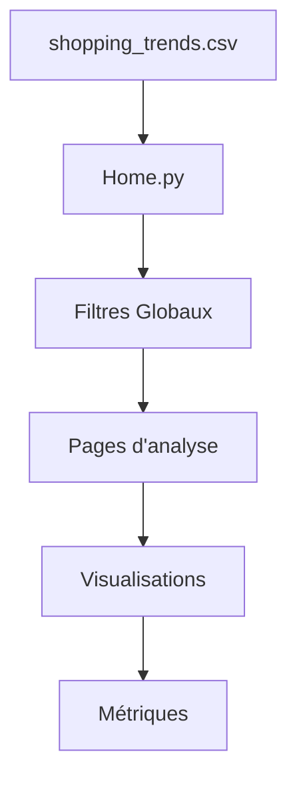

# Documentation Technique - Dashboard E-commerce

## 📋 Table des matières
1. [Vue d'ensemble](#vue-densemble)
2. [Architecture du projet](#architecture-du-projet)
3. [Configuration requise](#configuration-requise)
4. [Installation](#installation)
5. [Structure des fichiers](#structure-des-fichiers)
6. [Composants et fonctionnalités](#composants-et-fonctionnalités)
7. [Style et interface utilisateur](#style-et-interface-utilisateur)
8. [Gestion des données](#gestion-des-données)
9. [Guide de maintenance](#guide-de-maintenance)

## Vue d'ensemble

Ce projet est un tableau de bord analytique e-commerce développé avec Streamlit. Il permet d'analyser les tendances d'achat des clients à travers plusieurs dimensions :
- Analyse client
- Analyse des catégories de produits
- Analyse saisonnière
- Analyse du panier
- Analyse des paiements et livraisons

### Objectifs principaux
- Visualisation interactive des données e-commerce
- Analyse multi-dimensionnelle des comportements d'achat
- Interface utilisateur intuitive et moderne
- Performance et réactivité optimales

## Architecture du projet

### Structure générale
```
📦 e-commerce-dashboard
 ┣ 📂 pages/
 ┃ ┣ 📜 01_Analyse_Client.py
 ┃ ┣ 📜 02_Analyse_Categories.py
 ┃ ┣ 📜 03_Analyse_Saisonniere.py
 ┃ ┣ 📜 04_Analyse_Panier.py
 ┃ ┗ 📜 05_Paiements_Livraisons.py
 ┣ 📜 Home.py
 ┣ 📜 utils.py
 ┣ 📜 style.css
 ┗ 📜 requirements.txt
```

### Flux de données


## Configuration requise

### Prérequis système
- Python 3.8+
- pip (gestionnaire de paquets Python)
- 4GB RAM minimum
- Espace disque : 500MB minimum

### Dépendances principales
\`\`\`requirements.txt
streamlit>=1.24.0
pandas>=1.5.0
plotly>=5.13.0
numpy>=1.23.0
\`\`\`

## Installation

1. Créer un environnement virtuel :
\`\`\`bash
python -m venv .venv
\`\`\`

2. Activer l'environnement virtuel :
- Windows :
\`\`\`powershell
.venv\Scripts\activate
\`\`\`
- Linux/macOS :
\`\`\`bash
source .venv/bin/activate
\`\`\`

3. Installer les dépendances :
\`\`\`bash
pip install -r requirements.txt
\`\`\`

4. Lancer l'application :
\`\`\`bash
streamlit run Home.py
\`\`\`

## Structure des fichiers

### Home.py
Fichier principal du tableau de bord contenant :
- Configuration de la page
- Filtres globaux
- KPIs principaux
- Visualisations synthétiques
- Navigation vers les sous-pages

### utils.py
Module utilitaire contenant :
\`\`\`python
def load_css():
    # Charge le CSS personnalisé
    
def styled_container():
    # Crée un conteneur stylisé
    
def styled_title(text):
    # Crée un titre stylisé
    
def styled_subheader(text):
    # Crée un sous-titre stylisé
\`\`\`

### style.css
Fichier de style contenant :
- Styles globaux
- Personnalisation des composants Streamlit
- Animations et transitions
- Palette de couleurs
- Mise en page responsive

### Pages d'analyse

#### 01_Analyse_Client.py
- Analyse démographique
- Comportement d'achat
- Segmentation client
- Taux de fidélisation

#### 02_Analyse_Categories.py
- Performance par catégorie
- Tendances produits
- Analyse des prix
- Saisonnalité des catégories

#### 03_Analyse_Saisonniere.py
- Variations saisonnières
- Impact météorologique
- Pics de vente
- Prévisions saisonnières

#### 04_Analyse_Panier.py
- Composition des paniers
- Valeur moyenne
- Corrélations produits
- Fréquence d'achat

#### 05_Paiements_Livraisons.py
- Modes de paiement
- Délais de livraison
- Satisfaction client
- Performance logistique

## Composants et fonctionnalités

### Système de filtrage global
\`\`\`python
# Filtres dans la sidebar
with st.sidebar:
    selected_category = st.multiselect(
        "Catégorie de Produits",
        options=df['Category'].unique(),
        default=df['Category'].unique()
    )
\`\`\`

### Cache des données
\`\`\`python
@st.cache_data
def load_data():
    df = pd.read_csv('shopping_trends.csv')
    return df
\`\`\`

### Visualisations interactives
Utilisation de Plotly pour des graphiques interactifs :
\`\`\`python
fig = px.bar(
    data,
    x='Category',
    y='Purchase Amount (USD)',
    title='Ventes par Catégorie',
    color_discrete_sequence=['#1E88E5', '#5E35B1']
)
\`\`\`

## Style et interface utilisateur

### Palette de couleurs
- Principal : #1E88E5 (Bleu)
- Secondaire : #5E35B1 (Violet)
- Accent : #43A047 (Vert)
- Attention : #FB8C00 (Orange)

### Composants stylisés
- Conteneurs avec ombres
- Animations au survol
- Transitions fluides
- Espacement cohérent

### Responsive design
- Adaptation automatique aux écrans
- Layout flexible
- Composants redimensionnables

## Gestion des données

### Format des données
\`\`\`python
# Structure du DataFrame
df.columns = [
    'Customer ID',
    'Age',
    'Gender',
    'Category',
    'Purchase Amount (USD)',
    'Review Rating',
    # ...
]
\`\`\`

### Performance
- Mise en cache des données
- Filtrage optimisé
- Agrégations efficaces

## Guide de maintenance

### Ajout d'une nouvelle page
1. Créer un fichier dans le dossier `pages/`
2. Utiliser le modèle de base :
\`\`\`python
import streamlit as st
import pandas as pd
import plotly.express as px
from utils import load_css, styled_container, styled_title, styled_subheader

# Configuration
st.set_page_config(...)

# Chargement du CSS
load_css()

# Contenu de la page
styled_title("Titre")
\`\`\`

 
